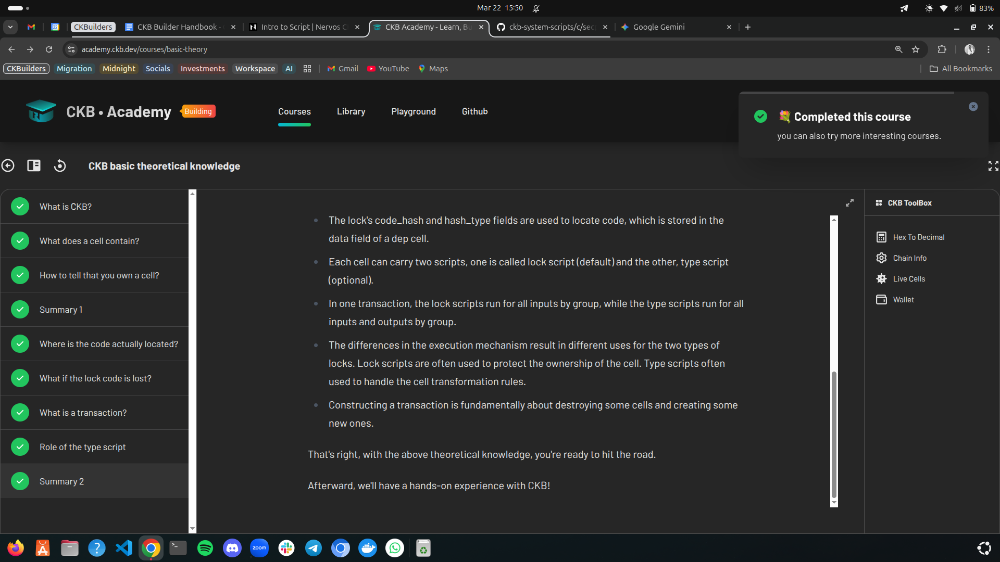

# Builder Track Weekly Report — Week 1

| Field           | Details        |
| --------------- | -------------- |
| **Name**        | Joseph Martins |
| **Week Ending** | March 21, 2026 |

---

## Practical Progress

### Key Docs Modules Reviewed

| Module                            | Status |
| --------------------------------- | ------ |
| How CKB Works                     | ✅     |
| Introduction to Scripting         | ✅     |
| Program Languages for Script      | ✅     |
| CKB Fundamentals (Entire section) | ✅     |
| Core Structures (Entire section)  | ✅     |

### OfficeCKB

| Task                   | Status |
| ---------------------- | ------ |
| Installation and setup | ✅     |
| Run OfficeCKB          | ✅     |

### CKB Academy Courses

| Lesson                                                                          | Status |
| ------------------------------------------------------------------------------- | ------ |
| Lesson 1 — CKB Basic Theoretical Knowledge  | ✅     |
| Lesson 2 — CKB Basic Practical Operation    | ✅     |

---

## Accomplishments

### Concepts Understood

- Fundamentals of CKB — CKBytes (native token: how it works, function, model and lifecycle) ✅
- CKB Core Structures — Cell Model (simplest unit of CKB), structure and definition ✅
- How to create a transaction ✅
- How to read and (manually) write transaction metadata ✅
- How to read block metadata ✅
- Indexing of cells and their dependencies ✅
- Config info of Testnet Chain ✅
- The model, config, and built-in scripts of CKB — including `SECP256K1_BLAKE160`, `SECP256K1_BLAKE160_MULTISIG`, `OMNILOCK`, and `DAO` ✅

### Created

- First manual transaction on CKB [View on Explorer](https://testnet.explorer.nervos.org/transaction/0xd11f97dab647f0c086385f6a39827cb87b3082a674b7fab0fa4091be623a16dd) ✅
- GitHub repo for report and activity tracking ✅
